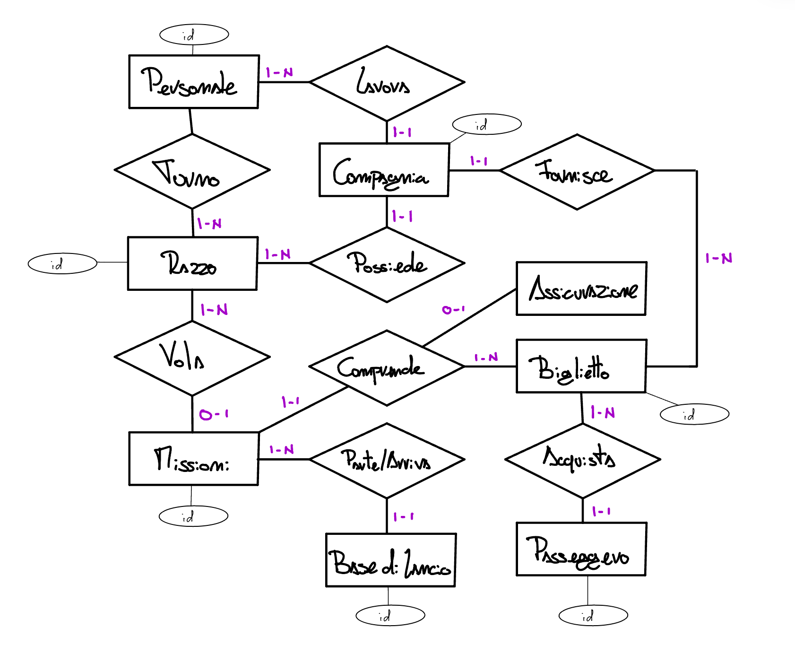
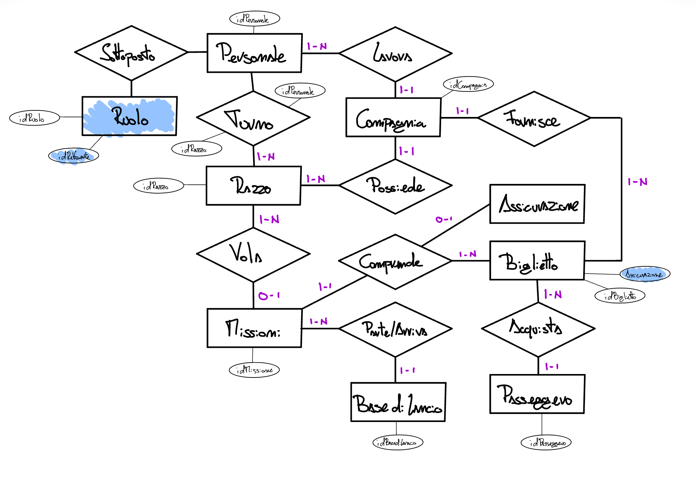
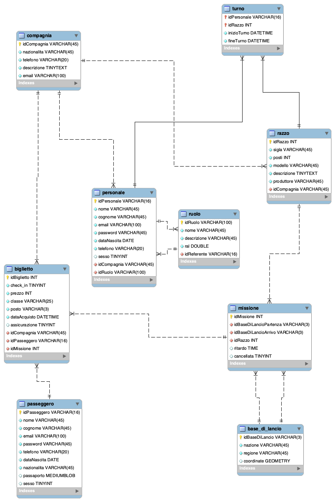

# Progetto di Basi di Dati

## Puccio Andrea SM3201456

### 15 maggio 2024

## Presentazione

Si vuole realizzare una base di dati che gestisca le principali basi di lancio spaziali globali. Per adempiere a questo compito sono state selezionate diverse entità e relazioni che ora approfondiremo.

### Passeggero

Il **Passeggero** rappresenta il cliente che acquista il biglietto per un determinato viaggio spaziale. Di lui si vuole sapere l’anagrafica generale e se possiede un passaporto o meno; il campo sesso è un booleano in cui 0 rappresenta i maschi e 1 le femmine. È l’utente della piattaforma.

### Biglietto

Del **Biglietto** si vuole tenere traccia dei seguenti dati: prezzo, classe, posto, data di acquisto, assicurazione. Inoltre, si vuole considerare che i biglietti appartengono ad una sola missione, compagnia e shuttle.

### Missione

Delle **Missioni** si vuole memorizzare la base di lancio di partenza e di arrivo, il razzo con cui è stata eseguita, anche l’eventuale ritardo o cancellazione sono salvate sulla tabella. Si fa notare che più biglietti possono appartenere ad una missione ed anche più razzi possono effettuare la stessa missione.

### Razzo

Dei **Razzi** salviamo sigla, il numero di posti (infatti inseriremo un trigger che non permette di vendere più biglietti della capienza massima del razzo), il modello, una breve descrizione ed il produttore. Le compagnie possono possedere più razzi ma non viceversa.

### Turno

Tra razzo e personale si crea una cross-table chiamata **Turno** con lo scopo di tenere traccia dei turni di lavoro che ogni dipendente svolge su un veicolo spaziale. Per fare ciò salviamo un `datetime()` ad inizio e fine turno.

### Personale

La tabella **Personale** è simile a quella dei Passeggeri poiché anche essi sono utenti della piattaforma con l’aggiunta del campo Ruolo e Compagnia.

### Compagnia

Dell’entità **Compagnia** si vuole salvare nazionalità, recapito e descrizione. Essa può erogare molteplici biglietti.

### Ruolo

L’entità **Ruolo** tiene traccia dei mestieri svolti all’interno della base di lancio e soprattutto il referente per ogni ruolo. Si suppone che i servizi di segreteria e amministrazione delle aziende siano gestiti internamente dalle stesse. Ruolo tiene traccia della retribuzione di ogni dipendente.

Si è deciso di non collegare missione e compagnia poiché si assume che la missione è il generico percorso che molteplici compagnie eseguono coi loro razzi. Inoltre, si fa notare che sia i razzi sia il personale dispongono della chiave esterna della compagnia poiché nella cross-table Turni sono ammessi anche “prestiti” di personale tra le compagnie al fine di garantire la continuità dei collegamenti spaziali essenziali.

Poiché i viaggi spaziali includono molti cambi di fuso orario tutti gli orari dei turni sono espressi in GMT (UTC +0). Il biglietto è facilmente rappresentabile in codice alphanumerico e jpeg, con l'utilizzo dell'assicurazione per rimborsare automaticamente i passeggeri in caso di ritardo del razzo superiore ai 15 minuti. Tale tecnologia sarebbe ideale per il DB e potrebbe essere integrata con minime modifiche ai campi assicurazione e biglietto.

## Diagramma E/R

 

## Scelta delle chiavi primarie

Si è deciso di adottare come chiave primaria lo standard “idNomeTabella”, essi sono identificatori auto incrementanti generati automaticamente dal DBMS ogni volta che c’è una query di inserimento. Ci sono alcune eccezioni, ad esempio, gli ID di passeggero e personale che sono rappresentati da un generico codice identificativo fornito dallo stato in cui si risiede (in Italia è il codice fiscale → 16 caratteri, si suppone che siano simili anche in altre nazioni). Le basi di lancio invece utilizzano i codici IATA costituiti da una stringa di 3 caratteri (ad esempio “KSC” Kennedy Space Center, Stati Uniti d'America). Per i razzi invece è stato adottato il numero seriale come chiave primaria. Per le compagnie non è stato scelto il numero di partita IVA poiché la sua conformazione cambia da nazione a nazione, si predilige l’utilizzo di un identificatore generato dal sistema. Per i ruoli è stata adottata una stringa che contenga il nome del ruolo dell’impiegato. Si fa notare inoltre che ruolo contiene a sua volta un idReferente che punta alla tabella personale, inoltre la tabella Missione contiene due FK provenienti da Base di Lancio.

## Dizionario dei Dati

| **Entità/Relazione** | **Descrizione** | **Attributi** | **Identificatore** |
|----------------------|-----------------|---------------|--------------------|
| Passeggero           | Utente della piattaforma | Nome, Cognome, E-mail, Nazionalità, Password, Sesso, Telefono, Passaporto, Data Nascita | ID Generico della propria nazione, CF nel caso italiano |
| Biglietto            | QR-Code/NFT che permette di accedere al razzo | Prezzo, Classe, Assicurazione, Check-In, PDF, Data Acquisto, Posto | idBiglietto, auto incrementante |
| Missione             | Generica missione spaziale effettuata da una compagnia tra due basi di lancio | Ritardo, Cancellata | idMissione, auto incrementante |
| Base di Lancio       | Partenza/Destinazione delle missioni | Nazione, Coordinate, Regione | idBaseLancio, codice IATA |
| Razzo                | Veicolo spaziale che esegue la missione | Sigla, Posti, Descrizione, Produttore | idRazzo, numero seriale |
| Personale            | Utente della piattaforma, lavora sui razzi | Nome, Cognome, E-mail, Password, Data Nascita, Sesso, Telefono | ID Generico della propria nazione, CF nel caso italiano |
| Turno                | Associa il personale al razzo assegnatogli | Inizio Turno, Fine Turno | ID Generico della propria nazione + idRazzo |
| Compagnia            | Azienda eroga i biglietti e possiede i razzi e le concessioni per le missioni | Nazionalità, Telefono, Descrizione, E-mail | idCompagnia, auto incrementante |
| Ruolo                | Il ruolo ricoperto dal personale in servizio | Nome, Descrizione, RAL | idRuolo, nome del ruolo |

## Vincoli non esprimibili

Analizzando i dati che il database andrà ad immagazzinare sorgono i seguenti vincoli:
- Non si possono vendere più biglietti rispetto alla quantità disponibile di posti su un razzo.
- Se l’assicurazione è stipulata all’esterno dei siti ufficiali delle compagnie spaziali non risulterà nel database.

## Tabella dei volumi

| **Concetto**   | **Tipo**  | **Volume** |
|----------------|-----------|------------|
| Passeggero     | Entità    | 500.000    |
| Biglietto      | Entità    | 500.000    |
| Missione       | Entità    | 5.000      |
| Base di Lancio | Entità    | 50         |
| Razzo          | Entità    | 5.000      |
| Turno          | Relazione | 100.000    |
| Personale      | Entità    | 50.000     |
| Compagnia      | Entità    | 250        |
| Ruolo          | Entità    | 10.000     |

## Diagramma E/R ristrutturato

NB. Sono evidenziate in blu le modifiche apportate al diagramma.
- Generalizzazioni eliminate, aggiunta della nuova entità Ruolo.
- Accorpamento di Assicurazione all’interno di Biglietto.
- Specifica degli id

## Analisi delle ridondanze

Sono presenti diverse ridondanze, esse sono state analizzate e strutturate in modo da ridurre notevolmente l’accesso ai dati e permettono di fare query piuttosto semplici e leggibili. Gli attributi composti sono stati volutamente evitati.

## Struttura del Database

(https://github.com/ipnopuccio/EsameDiBaseDiDati/blob/main/StrutturaDataBase.sql)

## Schema Logico 

## Normalizzazione 

La base di dati è già in prima forma normale, tutte le colonne sono atomiche.

La base di dati è già in seconda forma normale, ciascuna colonna dipende dalla primary key.

La base di dati è già in terza forma normale, ogni attributo dipende solo dalla primary key.

## Trigger

